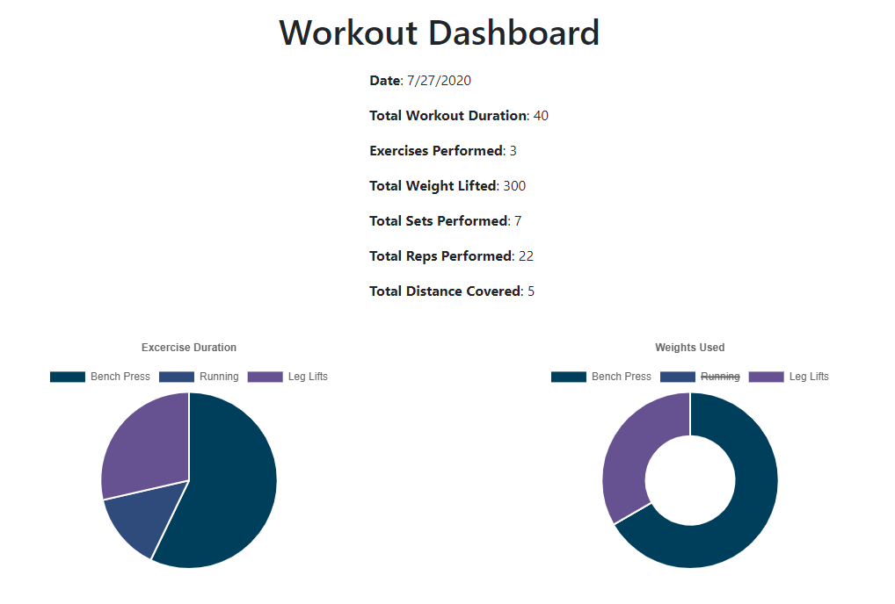

# Workout Tracker


Node-Express app using Mongoose for tracking workouts

## Table of Contents
- [Workout Tracker](#workout-tracker)
  - [Table of Contents](#table-of-contents)
  - [Installation](#installation)
    - [Front End](#front-end)
    - [Back End](#back-end)
  - [Launch](#launch)
  - [Usage](#usage)
- [Tests](#tests)
  - [Testing](#testing)
  - [Author](#author)

## Installation

### Front End
After cloning the repository, type:
```
npm install
```
to install all dependencies

### Back End
Make sure Mongo is running.

## Launch

To start the express server, type:
```
npm start
```
or
```
node ./server.js
```

## Usage

The dashboard on the home page displays information related to the Last Workout. Users can either create a new workout by clicking the New Workout button, or click Add Exercise to add an existing exercise to the last workout.

## Tests

After running the application and visiting the url, there should be a popup prompting you to create a workout if one doesn't exist. Select New Workout.

After selecting resistance or cardio, override the defaults for the exercise details, click Add Exercise.

Notice the home screen now includes details for the added workout.

Continue adding exercises by clicking Add Exercise and editing details.

Each time, watch the dashboard update with the exercise details.

Click the New Workout button again to discard the last workout and create a new exercise. Returning to the home screen, you should see the last workout has been updated with the newest workout with all the old workout information now hidden.

## Testing 
To start the app with test data populated, run 
```
npm run seed
```

## Author

* **Johnny Li** - *Initial work* - [reptile18](https://github.com/reptile18)
